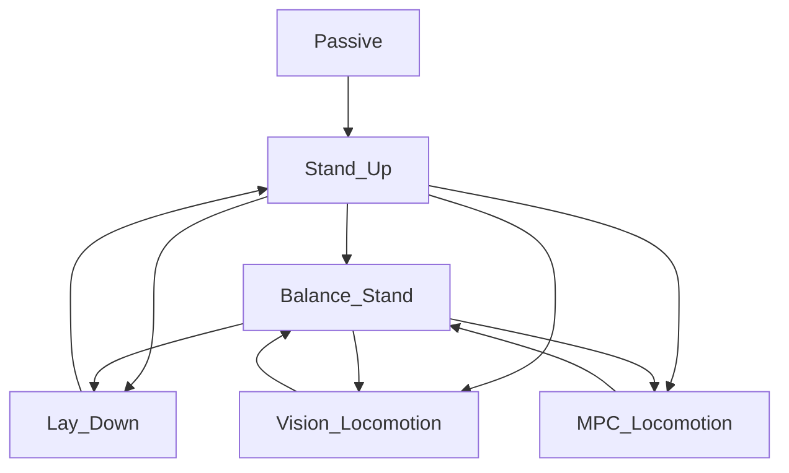

# Periodic_Adaptive_MPC

[](url)## Dependencies
Install Eigen3 from apt
```
sudo apt install libeigen3-dev
```
If you build it from source, delete it
```
cd <eigen_dir>/build
sudo make uninstall
```

Install apt dependencies
```
rosdep install --from-paths src --ignore-src -r -y --skip-keys "raisim"
# if not working
sudo apt install ros-noetic-pcl-ros
sudo apt install ros-noetic-grid-map
```

Build from source
```
cd <workspace>/src
git clone https://github.com/anybotics/kindr
git clone https://github.com/anybotics/kindr_ros
catkin build
```

## Usage

# Raisim simulator

Launch the visualizer. You can choose one of the following (opengl is easier for visualization):
```
# unity
roslaunch raisim unity.launch
# opengl
roslaunch raisim opengl.launch
```

Launch the Raisim server:
```
roslaunch raisim_unitree_ros_driver spawn.launch scene:=2
```
Arguments:
- scene - - indicates which objects will be created in the simulator scene.

Launch the controller for the simulator in a separate launch file:
```
roslaunch be2r_cmpc_unitree unitree_sim.launch
```

Launch the controller for the simulator with the universal launch file:
```
roslaunch be2r_cmpc_unitree unitree_a1.launch sim:=true rviz:=false rqt_reconfigure:=true
```
Arguments:
- sim - (bool) whether running in simulation or on a real robot;
- rviz - (bool) whether to start RViz;
- rqt_reconfigure - (bool) whether to start rqt.

Launch rqt to control states and adjust robot parameters (optional):
```
rqt
```

# Real Unitree A1
Launch the controller to control the real robot (separate launch file):
```
roslaunch be2r_cmpc_unitree unitree_real.launch
```

Launch the controller for the simulator with the universal launch file:
```
roslaunch be2r_cmpc_unitree unitree_a1.launch sim:=false rviz:=false rqt_reconfigure:=false
```
Arguments:
- sim - (bool) whether running in simulation or on a real robot;
- rviz - (bool) whether to start RViz;
- rqt_reconfigure - (bool) whether to start rqt.

# Finite State Machine (FSM)
You can exit from a gait state to the Passive state in two ways:
1. From any state directly. The motors switch to damping mode, and the robot smoothly goes to the ground.
2. Switch first to Balance_Stand, then Lay_Down, and finally Passive.


# External Disturbance
To add or change an external disturbance in the Raisim simulator, you must:

- change function applyExternalForce() in raisim_unitree_ros_driver/src/raisim_unitree_ros_driver.cpp file.

- change External Force Parameters in raisim_unitree_ros_driver/include/raisim_unitree_ros_driver file:
  

# Control System Description

Control system architecture:
 

# Adaptive MPC


